<a name="intro"/>
Introduction
============

Software is everywhere, binding our personal and social lives, embodying
a vast part of the technological knowledge that powers our industry,
supports modern research, mediates access to digital content and fuels
innovation. In a word, a rapidly increasing part of our collective
knowledge is embodied in, or depends on software artifacts.

Software does not come out of the blue: it is written by humans, in the
form of software Source Code, a precious, unique form of knowledge that,
besides being readily translated into machine-executable form, should
also "be written for humans to read" (@Abelson:SIC85), and "provides a
view into the mind of the designer" (@Shustek06).

As stated in the Paris Call on Software Source code as Heritage for
sustainable development (@ParisCall2019), from the
UNESCO-Inria expert group meeting, it is essential to preserve this
precious technical, scientific and cultural heritage over the long term.

Software Heritage is a non-profit, multi-stakeholder initiative,
launched by Inria in partnership with UNESCO, that has taken over this
challenge. Its stated mission is to collect, preserve, and make readily
accessible all the software source code ever written, in the Software
Heritage Archive. To this end, Software Heritage designed specific
strategies to collect software according to its nature (@swhcacm2018).

For software that is easily accessible online, and that can be copied
without specific legal authorizations, the approach is based on
automation. This way, as of September 2019, Software Heritage has
already archived more than 6 billion unique source code files from over
90 million different origins, focusing in priority on popular software
development platforms like GitHub and GitLab and rescuing software
source code from legacy platforms, such as Google Code and Gitorious
that once hosted more than 1.5 million projects.

For source code that is not easily accessible online, a different
approach is needed. It is necessary to cope with the variety of physical
media where the source code may be stored, the multiple copies and
versions that may be available, the potential input of the authors that
are still alive, and the existence of ancillary materials like
documentation, articles, books, technical reports, email exchanges. Such
an approach shall be based on a focused search, involving a significant
amount of human intervention, as demonstrated by the pioneering works
reconstructing the history of Unix (@SpinellisUnix2017) and the source code
of the Apollo Guidance Computer (@VirtualAGC).

This document presents the first version of SWHAP, the ***SoftWare
Heritage Acquisition Process*** to rescue, curate and illustrate
landmark legacy software source code, a joint initiative of Software
Heritage and the University of Pisa, in collaboration with UNESCO. 

The SWHAP process aims at preserving and presenting legacy software and related materials in a **digital** format, to ensure long term availability of the curated materials and the possibility to share and present it to a broad audience. 

<a name="context"/>
Who is this guide intended for and how to use it?
============

The goal of this guide is to allow any party interested in preserving, curating and presenting legacy softwares in a digital format to achieve the SWHAP process in full autonomy. 
Typically :
- An archive, museum or library 
- A company or research center
- Any individual wishing to archive its own legacy software products

Copyright disclaimer
--------------------

The individual or institution entering the SWHAP process should have all copyrights on the collected documents
TO DO: ellaborate on this

What entities are involved?
--------------------

- *A physical archive*: a physical location where physical raw materials are safely archived and stored. Maintaining the physical archive is the responsibility of the owner of the physical products or any third party untrusted by the owner, like a physical archive or a museum. 
- *Digital archives*: in the SWHAP process various types of digital archives are used for different types or artefacts. The proposed process relies on open source solutions even though you may be free to chose alternative options. The responsibility of maintaining these open-source digital archives lies in the different entities or consortia implementing them. The use of open source solutions ensure the best perenity of the archiving over time. 
- *Online presentation plateform*: although you are free to recreate your own website to present your software collection, we offer in this guide to leverage an open-source solution called "Science stories". In this guide we will show you how to contribute to the [Software Heritage implementation](https://stories.softwareheritage.org/), eventhough you may decide to create your own dedicated instance.
- *Digital working environment*: between the collection of physical or digital artefacts and the final archiving and presentation of the software a series of operations will have to be performed in a digital environment, which we will refer to as working depositories. If your are implementing the SWHAP process you will be responsible for implementing and managing these depositories, and to transfer part of its content to the digital archives and to the presentation plateform of your choice. We will further elaborate about that later in this document. 

TO DO : ajouter shéma

What are the different roles invovled?
--------------------

MF:  The role do not match the roles proposed in the workbecnh template (author, collector, curator). I would be in favor of making it simpler. If the process is simple enough (we should aim for it) there should bot be a need for archive engineer or web engineer.

With respect to the human resources, several roles are needed to enact
the process, as indicated in the top part of fig. 1. Here is a short
summary of the involved capabilities.

### Collector

Searches and receives the raw materials. Identifies, classifies and
separates source code and ancillary materials.

### Deposit engineer

Masters the procedures to archive physical and digital materials, in the
local context.

### Curator

Prepares the version history, identifying the authors and other
contributors. Provides a context to the source code, choosing among the
ancillary materials.

### Archive engineer

Masters the procedures to transfer the curated source code to SWH and to
publish the context in the Wikies.

### Presentation designer and Web engineer

These are out of the scope of this document, and are mentioned only to
note that, though most of the presentations of the archived software
will be on line, the abilities to design the contents of a presentation
should be considered separately from the technical ones.

**[Remark]{.underline}** the roles indicated above need not necessarily
be played by different persons, e.g., Collector and Curator may be the
same person, nor be played by a unique person, e.g., there can be
several cooperating Curators, in case of large systems.

What if I am stuck or have a question ?
--------------------

Because we are still developping and improving the SWHAP process you may stumble upon some difficulties, have some doubts on the best practices to adopt or you may just want to suggest an improvment. 

First, we suggest you checkout our FAQ: TO DO: create FAQ and input link

If you can't find what you are looking for there, please reachout to: TO DO: decide if we want to provide a contact point

What is the content of this guide?
--------------------

Section {@sec:processabs} provides an *abstract* view of SWHAP, its steps,
documents and resources. No specific assumptions on the *tools, platforms and
technologies* that may be used to enact it are made, but some requirements are
made explicit. Section {@sec:processconcrete} describes how the abstract process
is implemented at the University of Pisa by leveraging the Git toolset and the
GitHub collaborative development platform. This implementation is named SWHAPPE
(SWH Acquisition Process Pisa Enactor) in this document. Finally, Section {@sec:walkthrough}
provides a walkthrough on an annotated example, using a real world medium-sized software
project (@AttardiF96).

##### Table of Contents 
[Inroduction](#intro)
[Who is this guide intended for and how to use it?](#context)
[The process, abstract view](#abstractview) 
[The process, concrete view](#concreteview) 
[A walkthrough on a running example](#runningexample)
[Appendix A](#appendixa)
[Appendix B](#appendixb)
[Appendix C](#appendixc)
[Bibliography](#bibliography)

<a name="abstractview"/>
The process, abstract view {#sec:processabs}
==========================

This section describes SWHAP, the acquisition process for software
artifacts at an *abstract* level, that is, without making specific
assumptions on the *tools, platforms and technologies* that may be used
to perform the various operations described here.

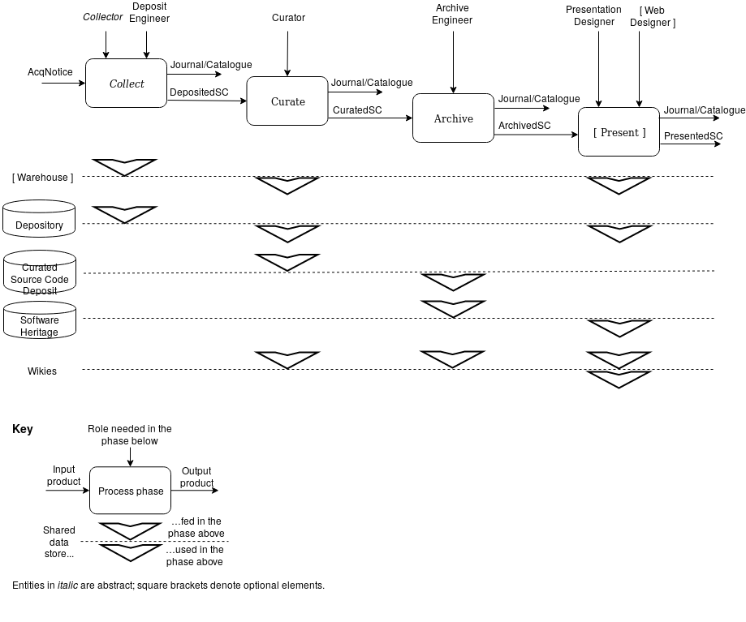{#fig:absprocess}

Phases
------

The activities involved in the acquisition process can be organized in the
following four phases.

- **Collect**: the first phase  is *conservative*, i.e., it is devoted to save the raw materials, in their physical or digital format, that the other phases will build upon.
- **Curate**: the second phase aims at *analyzing, cleaning up and structuring* the raw materials that have been collected.
- **Archive**: the third phase's goal is to contribute the curated materials to the digital infrastructures specialized for each kind of materials. From this stage on, all the curated material should have been digitalised in order to be processed. 
- **Present** The purpose of this phase is to create dedicated presentations of the curated materials.

Figure {@fig:absprocess} provides a pictorial view of the process, its phases,
data stores and roles.

### **Collect** 

The purpose of this phase is *to find* the source code and related
materials and *gather* it *as is* in a physical and/or logical place
where it can be properly *archived* for later processing.

Various *strategies* are possible for collecting the raw materials: a
dedicated team may proactively search for the artifact of specific
software that has been identified as relevant (*pull approach*), or a
crowdsourcing process may be set up to allow interested parties to
submit software that has not been previously identified (*push
approach*).

*Source code* can be provided in a *digital* or *physical* form.
Typically, source code for old machines (such as the first Italian
computer, CEP, now exposed in the Pisa museum of computing) is available
only as paper printouts that may even include hand-written comments: all
these materials deserve to be preserved.

*Related materials* can include research articles, pictures, drawings,
user manuals: all of these are part of the software history and need to
be preserved as well as the source code.

At this stage of elaboration of the process, this phase is better
thought of as *abstract*, in the sense that several, more focussed
descriptions should be provided to cater for the different situations
identified. The same applies to the Curator role, which may need
different capabilities in different scenarios.

### **Curate**

The purpose of this phase is *to* *analyze, cleanup and structure* the
raw materials that have been collected.

Preparing software source code for archival in **Software Heritage**
requires special care: the source code needs to be *cleaned up*,
different *versions* with their *production dates need to be
ascertained*, and the *contributors need to be identified* in order to
build a *faithful history of the evolution* of the software over time.

For both source code artifacts and ancilliary artificats, proper *metadata* should be created and made available, providing all the key information about the artifacts that are discovered during the curation phase. 
Regarding source code artifcats, we recommend to use the
vocabulary provided by **CodeMeta** as an extension to schema.org (see
[[https://codemeta.github.io/terms/]{.underline}](https://codemeta.github.io/terms/));
this includes the software runtime platform, programming languages,
authors, license, etc.
For other artifacts we will provide a dedicated template. 

Particular care is required to *identify the owners* of the different
artifacts, and *obtain if needed the necessary authorizations* to make
these artifacts publicly available[^1].

### **Archive**

The purpose of this phase is to contribute the curated materials to the
infrastructures specialized for each kind of materials: ***Software
Heritage*** for the *source code*, ***Wikimedia*** for *images or
videos*, ***open access repositories*** for *research articles*,
***Wikidata*** for *software descriptions and properties*, and so on.

Well established guidelines are available for contributing materials to
Wikimedia (see
[[https://commons.wikimedia.org/wiki/Commons:First\_steps/Contributing]{.underline}](https://commons.wikimedia.org/wiki/Commons:First_steps/Contributing))
and Wikidata (see
[[https://www.wikidata.org/wiki/Wikidata:Data\_donation]{.underline}](https://www.wikidata.org/wiki/Wikidata:Data_donation)
), hence we will focus primarily on curating and contributing the
software source code to Software Heritage, a process that is new and may
require rather technical steps.

### **Present** 

TO DO: Update with science stories / software stories

The purpose of this phase is to create dedicated presentations of the
curated materials.

Once the curated materials are made available in the dedicated
infrastructures, it is possible to use it to create presentations for a
variety of purposes: special events, virtual or physical expositions for
museums or websites.

For this, the archived materials need to be referenced using the
identifiers that each platform provides for its contents. Software
Heritage provides intrinsic persistent identifiers that are fully
documented at
[[https://docs.softwareheritage.org/devel/swh-model/persistent-identifiers.html]{.underline}](https://docs.softwareheritage.org/devel/swh-model/persistent-identifiers.html)

The presentation phase is out of the scope of this document, and as such
we are currently not providing a supporting implementation. Anyway, a
good example of what can be done is the
[[https://sciencestories.io]{.underline}](https://sciencestories.io)
website.

An iterative process
--------------------

New information may arise at any time: new raw materials may be
discovered, refined information may be identified that needs to be added
to the curation, and mistakes may need to be corrected. Hence, the
overall process must be seen as *iterative*, in the sense that, when new
data are available, the pertinent phase can be re-entered and the
process enacted once more from there to update all the relevant
information. This suggests that, whenever possible, the data stores
should be fully versionable, not to loose historical information about
the acquisition process itself.

<!--Resources needed by the process
-------------------------------

As any process supported digitally, SWHAP needs both human and technical
resources to be enacted.

First of all, several data stores and working areas are needed, to save
and make public the intermediate products, which are themselves of
value, as already mentioned, and to pass the collected information
across the phases. These are shown in the lower part of Figure 1, and
are summarized here. -->

<!--

MF: I think this should be moved earlier in the document and explaining who is responible for what. I don't fully get the role of the Despository. I don't think things are "safely archived" on Github (otherwise we wouldn't need SWH!), so I don't see the point of maintaining the depository there. 
Also this is mixing thing which are part of the SWHAP process iteself and some which are not (like the warehouse). 

### Warehouse

A physical location where physical raw materials are safely archived and
stored, with the usual acquisition process[^2].

### Depository

A virtual space where digital raw materials are safely archived. The raw
digital materials found in the Depository are used in the Curation phase
to produce the source code that Software Heritage can ingest in the
Archive phase.

The Depository holds also the related raw materials that may be
elaborated and deposited in locations like WikiData, WikiMedia etc. -
referred to as **Wikies** in fig. 1 - in the other phases.

### Workbench

Any implementation of the process will need a virtual space and working
environment where the activities can be carried out, with support for
temporary storage and for logging the various operations in a journal.

### Curated source code deposit

A fully versioned repository, holding the reconstructed development
history of the source code, in view of its transfer to Software
Heritage.

### Catalogues and journals

As shown in fig. 1, according to the best practices of the archival
sciences, each phase shall produce both a *Catalogue* of its products
and a *Journal* recording its activities - *who did what, and when*. A
list of the *Actors* involved in the process is also necessary.
Provision to store all these information safely has to be foreseen in
any supporting implementation.
-->

<!--
**[Remark]{.underline}** the technical resources described above in
abstract terms, may be implemented in a variety of ways. For example,
one can imagine a single Depository for all the software projects that
are collected, but it is also possible to use a separate Depository for
each software project, and the same holds for all the other areas.
-->

Implementation requirements
---------------------------

The abstract process may be implemented using different tools, platforms
and technologies, as long as the following key requirements are
satisfied.

### Long term availability

The places where the artefact (both raw and curated) are stored must
provide sufficient guarantees of availability over the long term. These
places may be physical (warehouses), or logical (depositories).

### Historical accuracy

Any supporting implementation should support the faithful recording of
the authorship of the source code as well as of the reconstruction
process, e.g., via a flexible versioning system.

### Traceability

It must be possible to trace the origin of each of the artifacts that
are collected, curated and deposited. For physical materials, we refer
to common practice[^3]. For digital artifacts, it is recommended to keep
a *journal of all the operations* that are performed, and to automate
them as much as possible, as the collection and curation process may
require several iterations.

### Openness

Any supporting implementation should be based on open and free tools and
standards.

### Interoperability 

Any supporting implementation should provide support for the cooperation
and coordination of the many actors playing the many roles of the
acquisition process.

\clearpage

<a name="concreteview"/>
The process, a concrete view {#sec:processconcrete}
============================

MF: the process should start with collecting, are at least making it clear we are not tackling it here. Otherwise hard to understand where we are starting from. 

In this process we are assuming that you have a place (refered to as _Warehouse_) to gather any relevant physical artifacts. Because the SWHAP process is about digital archiving and presenting, we also assume that you have digitalized (scanning or taking pictures) of these items to be further ingested in the SWHAP process. From now own, we will be focusing on the digital process only. 

In order to implement SWHAP, the first step is to create the *Digital working environment* that will allow you to store the collected digital artifacts and to curate them. This can very well be set up using
distinct digital platforms, but it is also possible to instantiate all
of them on a single platform.

The latter choice was made for the SWHAP Pisa Enactor (SWHAPPE). The
implementation adopted by the SWHAP\@Pisa project relies on the
collaborative platform [[GitHub]{.underline}](https://github.com/) (
[[https://github.com/]{.underline}](https://github.com/) ) as a host
platform for all the virtual support areas of the process. If you are interested in further understaning the rational for using Github, you can refere to Appendix A. TO DO: add link

Process overview
----------------

The core of the process will take place in your *Digital working environnement*. We propose to structure your *Digital working environment* into three disctinct areas, materialized by different folders, also called repositories on Github.

> *Workbench* repository, a working
> area where one can temporarily collect the materials and then proceed
> to curate the code;
>
> *Depository* repository, where we can
> collect and keep separated the raw materials from the curated source
> code;
>
> *Source Code* repository, to implement the Curated source code
> deposit, where we store the version history of the code; this version
> history is usually "synthetic", rebuilt by the curation team, for old
> projects that did not use a version control system.

Note that *Workbench* repository will be instantiated at the very beginning of the process as your main working environnement. *Depository* repository and *Source Code* repository will be instantiated later on, as specific extracts from the *Workbench*. Let's first see how to instantiate your *Workbench*.

### Instantiating your Workbench

<!--
MF: is this comment needed ? Maybe to precise at this stage (avoiding mental overload). 
Let's remark that SWHAPPE has *different* Workbench and Depository
repositories for each code acquisition, but it would also be possible to
use a single Workbench repository and/or a single Depository repository
to work on all the collected software, provided one maintains a
well-organised directory structure which keeps the codes separated. On
the other hand, we *need* a Source Code repository for each software
project, to be actually ingested in the Software Heritage archive.
-->

<!--
The Warehouse is quite similar to the usual storage area where museums
preserve their collections; it will need to be set up in a specific
physical location, following the well established process for museums,
so we will not cover it in this guide.
-->

We created a *template* repository that you can easily copy to instantiate your dedicated workbench. 
The [SWHAP-TEMPLATE](https://github.com/Unipisa/SWHAP-TEMPLATE) embodies the core support to enact the process. Its
structure and use is shown in figure 2. After copying it, you can change its name to *SWName-Workbench* ; the *SWName* being the name of the Software you are working on. 

We recommand you to clone your *SWName-Workbench*
repository to your machine, so that
you can work on the collected files locally - the Git clone mechanism
ensures that these changes can be safely moved to the original
repository, for publication and sharing with other actors in the
acquisition.

<!-- Too detailed at this point IMO
We create two dedicated *branches*[^4], that allow to track separately
the operations that will be later moved to the Depository and the
Development History Deposit: *Depository*, to contain the raw materials
and the browsable sources as well as the metadata, and *SourceCode* to
organize the source code in view of the reconstruction of its
development history. Finally, the *Depository* and *SourceCode* branches will
become two distinct repositories: the latter is shipped to the Software Heritage
archive, the former is published by the organization promoting the
acquisition.
-->

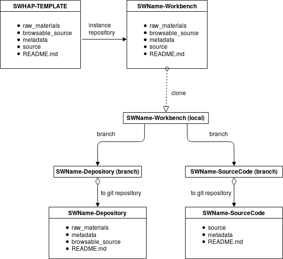{#fig:swhappe}

Figure 2. Overview of the SWHAPPE process.

### Workbench structure

The structure of the template is shown in Fig. 3.

<!-- 

MF: I don't understand this sentence,le t's just discribe each folder and what is it for

First of all, we can see a correspondence between the Depository
presented in the process and the area provided by `raw_materials` and
`browsable_source`: indeed, these two folders will be moved in order to
instantiate the Depository, once they have been loaded, the former with
the original materials, just as they have been found or submitted, the
latter with a first revision of the source code, made accessible through
the GitHub web interface, e.g., archives should be decompressed, code
transcribed from pictures, etc.
-->

Your newly created workbench is composed of the following folders:
- The `raw_materials` folder used to store all the collected materials in their intial format (ex: source code can be a scanned document) 
- The `browsable source` folder is used to store source code in browsable format (ex: if needed the source as been transcribed in machine readable format)
- The `additional_materials` folder is used to store all the other collected materials (video, pictures, documents etc)
- The `source` folder will be used to recreate the development history of the software, using the *commit* and *versioning* mechanisms of
*Git*
- The metadata folder, is used to record all the information about the
software and the acquisition process (catalogue, actors, journal, etc.).
The guidelines to fill this part are given in the template itself. (MF: I think we should include part of it in the guide, otherwise not clear when is the best moment to fill them in)

<!--
The `source` folder is provided as the starting point for the creation of
the Source Code *Git* repository, in the curation phase. The curator has
to recognize each major version of the code, and refactor it accordingly
- one separate folder per each version. To create the Source Code
Deposit, however, we exploit the *commit* and *versioning* mechanisms of
*Git*.
-->

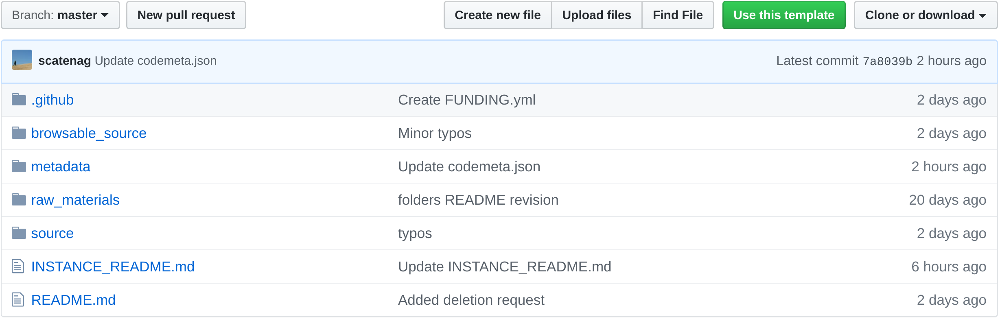{#fig:template}

<!--
The process, step by step
-------------------------

### Instantiation

The first step is to create an instance of the SWHAP-TEMPLATE[^5], that
should be named SWName-Workbench*,* and then to clone it to obtain a
local copy on your machine[^6].

From this point on, you'll be able to upload files and to
modify/copy/move them locally, and use *Git* commands to push changes to
GitHub.

Let us now see the steps to be followed, together with some
explanations.
-->

### Collect phase

**Collect artifacts and upload them**

In this first phase you want to spend times collecting the sofwtare artifacts, either in physical or digital format. Appart from source code, it is also important to collect relevant ancillary materials such as pictures, documentation, articles etc.
Whenever possible, we encourage you to reach out to the authors of the softwares and/or to the institution they belonged to. They might hold some precious documents such as pictures, mails etc. 

We encourage you to dititalise (by scanning or photographying) all the relevant physical objects. 

All the collected digital files must then be uploaded in the `raw_materials` folder.

To every collected item should correspond an entry in the `catalogue.md`file, located in the `metadata`folder. If there are physical materials, make a different entry for the object itself, indicating its warehouse or storage location, and for its digital version. (MF: is it the case?)

<!-- MF: should'nt that be done in the metadata folder? I feel like Spectrum guidelines are way over the top, we are not a museum. + is this our role? 
If there are physical materials, folder `raw_materials` should contain
a reference to the related Warehouse, that may follow the Spectrum
guidelines [\[8\]](https://www.zotero.org/google-docs/?X25TEk).

MF: wrong link, to be updated if relevant
-->

**Make the source code machine readable**

The next step is to ensure that the collected source code is made available in a machine-readable format. 

If the code is only available in non digital form (e.g. printed
listings), you can either transcribe it manually, or use a scanner and
an OCR (optical character recognition) tool to parse it. See
[[Appendix
A]{.underline}](http://www.corestandards.org/assets/Appendix_A.pdf)
for a list of suggested tools. 

If the raw source code is an archive file (.tar) and/or compressed, you should unpack it locally on your computer. 

Once you made your source code machine readable, all the source code files must then be put into the `browsable_source`
folder.

Particular care should be used to ensure the files in
`browsable_source` have the correct extension: scanner and OCR usually
generate files with a generic .txt extension, that must be changed to
the extension typically used for the programming language they
contain.

Note that, at this stage, we are not interested in precise information
about the versions of the software. The purpose is to have
machine-readable documents.

Finally, in preparation for the curation phase, you may want to copy
the files in `browsable_source` to the `source` folder. TO DO: why? 

**Create Depository**

MF: we need to explain what this depository is actually for. Also why create a branch and not just create directly the Depository?
Shall we fill in the àdditional amterials`folder before creating the Depository ? This seems more like the curating phase

The next step is to create the branch Depository, containing only the
folders `raw_materials` and `browsable_source`, together with the
metadata updated to this point. Then, create the Depository repository
from this branch.

### Curate phase

**Curate the source code**

<!-- unclear sentence
Once the Depository creation is complete, you can move back to the
`source` folder in the master branch. -->

The curation phase will allow you to recreate the development history of the code, leveraging the *commit* and *versionning mechanisms of Git. To prepare for the reconstruction itlsef you need to organize your source code files properly and to identify metadata.  

First, sort out the source code files present int the `browsable_source` folder, putting them in a different folder for each version. You can typically call each folder `MySoftware-V1.0`, `MySoftware-V2.0`etc. 

Second,determine who did what and when.

In practice, this means that *for each version of the software* you
need to ascertain:

-   the *main contributing author*,
-   the *exact date* of the release of this particular version

This information should be consigned in the `version_history.csv` in the `metadata`folder, with the following fields:

\rowcolors{1}{gray!10}{white} 

| Field name          | description                                                      |
|---------------------+------------------------------------------------------------------|
| directory name 	 | name of the directory containing the source code of this version |
| author name    	 | name of the main author                                          |
| author email   	 | email of the main author, when available                         |
| date original  	 | original date when this version was made                         |
| curator name   	 | name of the curator person or team                               |
| curator email  	 | the reference email of the acquisition process                   |
| release tag   	  | a tag name if the directory contains a release, empty otherwise  |
| message 	 | text containing a brief note from the curation team              |

Now you are ready to (re-)create the development history of the
software, by successively commiting the source code files of each version from the `browsable source` into the `source` folder, updating the commits metadata to reflect historical develoment.  

<!--First you need to create a branch Source Code, with the
*source* folder.-->

You can proceed in two ways:

-   *manually*: using the *Git* commands to push the successive versions
    into the `source` folder, reading the information collected in the
    file `version_history.csv` to set the fields for each version to
    the values determined during the curation phase;

-   *automatically*: using a tool that reads the information from
    `version_history.csv` and produces the synthetic history in a
    single run; one such tool has been developed, DT2SG
    ([[https://github.com/Unipisa/DT2SG]{.underline}](https://github.com/Unipisa/DT2SG))
    , and you can see a running example in the next section.

The result will be a `source`folder that materializes the development history
of the software via Git commits and releases.

**Curate the ancillary materials**

From the `raw_materials` folder, select the ancillary materials that you wish to keep for archival and presentation, and move them in the `additional_materials` foLder. You should sort them in the right subfolder : `software_moment`, `people_moment` or `other_materials`

**Create the final repository**

MF: this should be part of archiving IMO. A dedicated repo is only need because of SWH ingestion process if I understand well. 
Finally you can create the "official" software repository, taking the
versions history from the Source-Code branch and the metadata from the master
branch.

Iteration
---------

TO DO : to be updated, I don't think adding a simple picture should require clone and pushing etc. 

New material may be discovered after the process has been completed,
triggering an iteration of some of the phases described above. In this
case, we recommend to proceed as follows:

-   if new raw material (non-source code) is found, we have to clone the
    Depository repository and add new items to it. In this way, the
    performed commits will correctly follow the previous ones.

-   if new source code is found, after we collected it in the
    Depository, we have the following cases:

> \(1) The recovered source code is related to a version which is already
> included in the software history.
>
> \(2) The source code represents a completely new version, with respect to
> the software history as it was previously collected.

We are not finished yet, since in both cases the SourceCode repository
is no longer consistent with the collected source code, and we have to
recreate it, performing the following steps:

-   Delete the SourceCode repository.

-   Move back to the Workbench and according to the current case:

> if (1), add the source code to the correct version.
>
> if (2), add the new version folder with the related metadata.

-   Recreate the software history as for the first iteration.

### Archving

**Archving Source Code**

TO DO: Add the logic of archiving in SWH

**Archiving Ancillary materials**

TO DO: Add the logic of archiving in Wikimedia/wikidata etc

### Presenting

TO DO: Add story creation instructions

<a name="runningexample"/>
A walkthrough on a running example {#sec:walkthrough}
==================================

In this section we will show the process at work on one of the first
source code acquired by the SWHAP\@Pisa project, the CMM conservative
garbage collector for C++ that was initially developed for project PoSSo
(Polynomial System Solver) and later became the basis for the Java GC
and the Oak GC [\[7\]](https://www.zotero.org/google-docs/?tVCOZn).
Since it has evolved through various versions, CMM is a good workbench
for SWHAPPE and an appropriate example to show how to use the tools.

### Starting the process

The acquisition process of the CMM software started informally when one
of the authors, still active in the Computer Science department, learned
about the SWHAP project, and proposed to search for the source code and
make it available to the project. Shortly after, we received a mail
message with all the sources, as well as the associated research
article. Since the materials were already in digital form, the process
does not involve a Warehouse.

### Instantiation

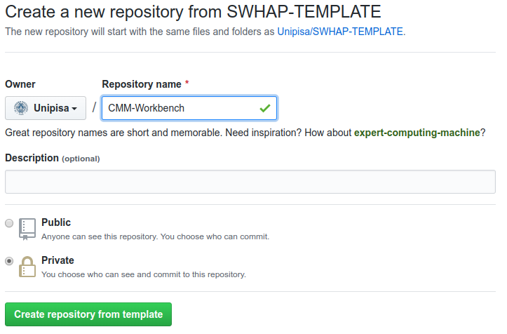{#fig:temp_inst}

We instantiate on GitHub the SWHAP repository template[^8] into a new
repository[^9], that we name "CMM-Workbench". This action, as most of
the following ones, can be performed through the user interface (as
shown in Figure {@fig:temp_inst}), or programmatically through the GitHub API.

It has the same directory structure as SWHAP-Template, as shown in Figure
{@fig:template}.

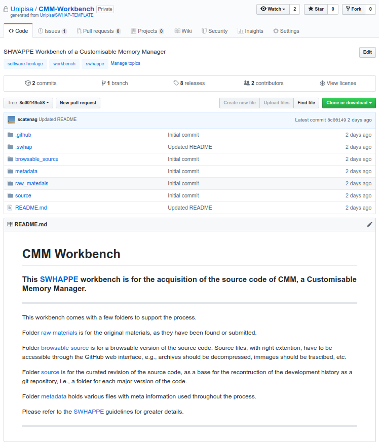{#fig:cmm_wb_inst}

To facilitate the search of the created repository, we add the 
"software-heritage", "workbench" and "swhappe" tags, as shown in Figure
{@fig:workbench_tags}.

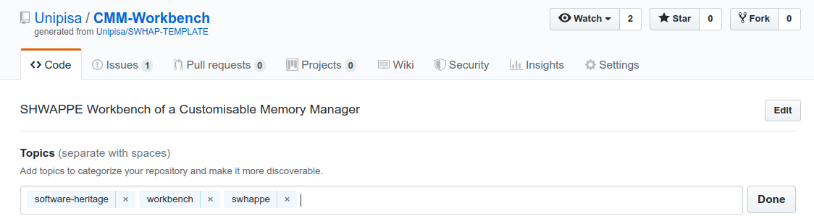{#fig:workbench_tags}

To start working, we create a local copy on our computer, cloning this
repository[^10]. By clicking on the green button "clone or download"
(Figure {@fig:cmm_wb_inst}), we get a link that we can use for this purpose in the
following command from the command line:

    git clone https://github.com/Unipisa/CMM-Workbench.git

Now, we have a local copy of the CMM-Workbench, and we can, first of
all, update the README.md file with the correct name and description of
the acquisition, and synchronize it with the remote repository:

	git add README.md
	git commit README.md -m "Updated README"
	git push

We are now ready to start the collect phase.

### Upload files in raw\_materials

Here we fill the local folders with the collected material. In the case
of CMM, we got a tar.gz file containing the various versions of the
software, organized according to an ad-hoc versioning system. In the
`raw_materials` folder we store also the paper presenting the software
and the email that Giuseppe Attardi sent us along with them,
and we commit all these new contents:

	git add raw_materials
	git commit -m "Added raw material"
	git push

The resulting state of `raw_materials` is shown in Figure {@fig:cmm_raw}.

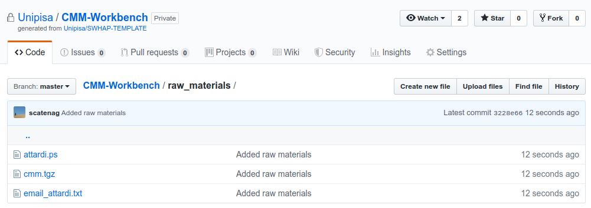{#fig:cmm_raw}

### Unpack the source code in the browsable\_source directory 

In order to get a browsable version of the source code, we decompress
the .tar.gz archive into the `browsable_source` folder

    tar -xzf raw_materials/cmm.tgz -C browsable_source

and commit the changes as done for the `raw_materials` folder

    git add browsable_source
    git commit -m "Added browsable source"
    git push

We can see the resulting state of the repository in Figure {@fig:cmm_brows}.

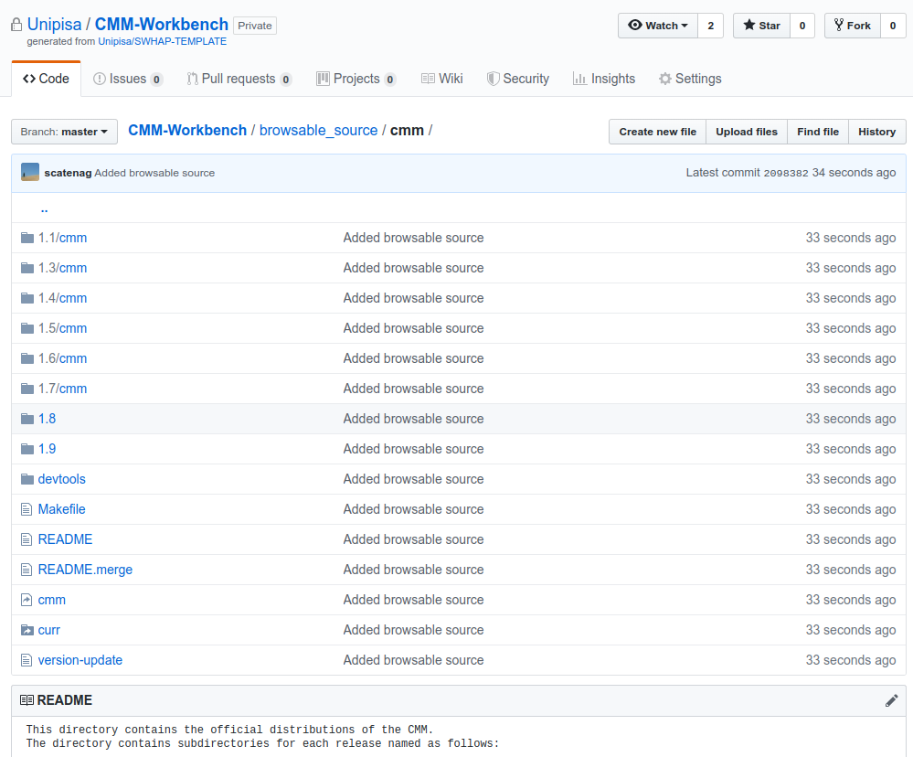{#fig:cmm_brows}

Finally, in preparation for the next phase, curation, we copy the files
contained in `browsable_source` into the `source` folder[^11].

    cp -r browsable_source source

Again, we stage changes as in the previous two steps.

	git add source
	git commit -m "Added source"
	git push

### Create Depository

The Depository has been filled, hence we create the Depository as an
orphan branch, i.e., with no references to the parent repository, using
the checkout command:

    git checkout --orphan Depository

As a result, we moved to the Depository branch. Here we modify the
README (guidelines to fill the README file are given in the template)
and remove the `source` and `metadata` folder, since they are not
interesting for this area:

    git rm -rf source metadata

We stage the last modifications and then push to the remote repository.

	git add .
	git commit -m "Added raw materials from master branch"
	git push --mirror origin

We are almost ready to move the Depository to a new repository: before that,
however, we have to create the new remote repository on GitHub (Figure
{@fig:cmm_depo_creat} shows how to do this using the web interface; here too one
could use the GitHub API instead).

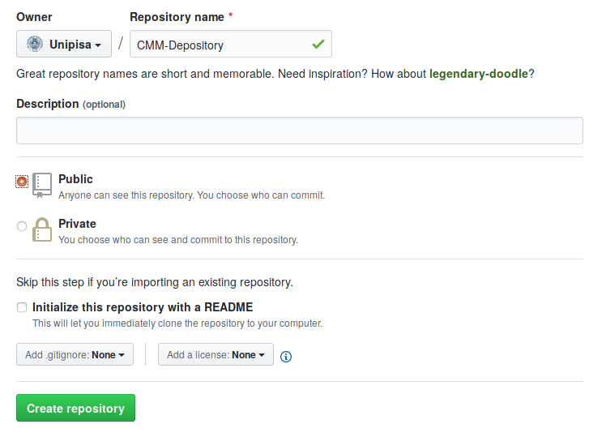{#fig:cmm_depo_creat}

To facilitate the search of the created repository, we add the 
"software-heritage", "depository" and "swhappe" tags (in the same way of 
what done for the workbench as shown in Figure
{@fig:workbench_tags}).

### Final depository

Finally, we can perform a push and fill the remote repository.

    git push https://github.com/Unipisa/CMM-Depository.git +Depository:master

We can check the resulting repositories via the web interface (Figure
{@fig:cmm_repos}): CMM-Depository is now filled with the pushed materials.

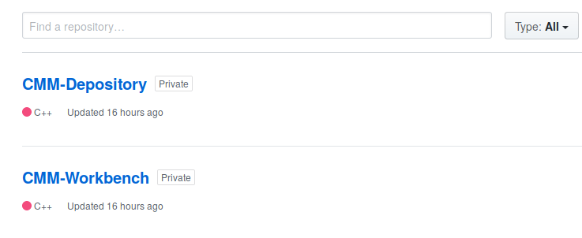{#fig:cmm_repos}

The Depository branch is then removed from the Workbench, to avoid
having multiple copies that may diverge. Should new materials became
available, a new iteration of the process should start, re-initializing
the Workbench with the information in the Depository.

	git checkout master
	git push --delete origin Depository
	git branch -D Depository

### Curate the code

#### Version History

In this phase, the curation team should clean up the code and organize
it in separate folders, one per version. In the case of CMM, the code is
already structured this way, as shown in Figure
{@fig:cmm_repos}, so there is nothing
to do.

In order to support the (re-)creation of the development history of the
original project, we prepare the `version_history.csv` file with the
appropriate metadata (see Figure {@fig:cmm_vers_hist}).

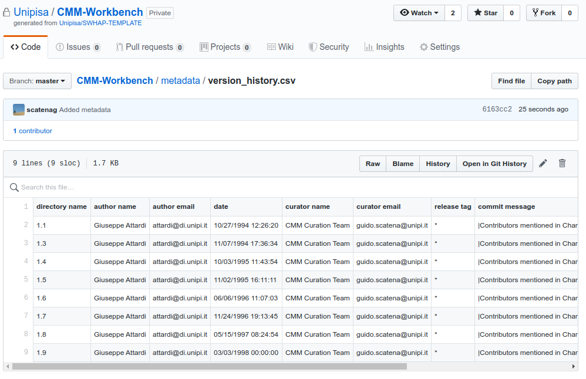{#fig:cmm_vers_hist}

#### Codemeta

Contextually we fill the `metadata/codemeta.json` template file (see Figure {@fig:cmm_json}, left) with metadata according to [CodeMeta guidelines](https://codemeta.github.io/terms/) obtaining what shown in  (see Figure {@fig:cmm_json}, right).

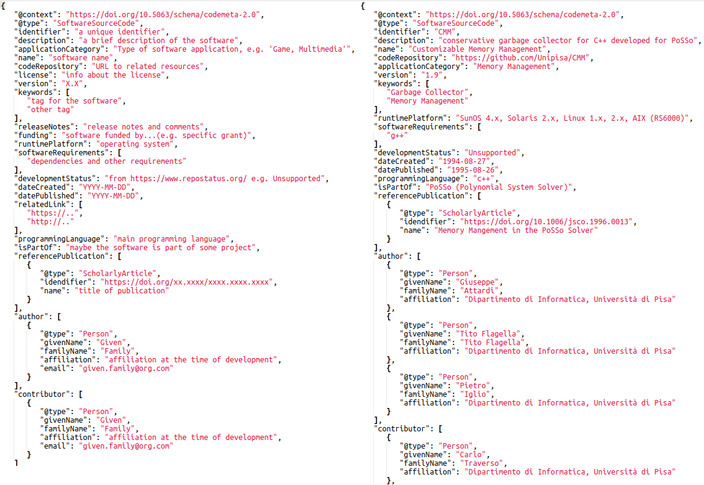{#fig:cmm_json}

#### License

To conclude the curation phase, we have to identify licensing information.

If we find a file specyfing the licence in the source code, we have to copy its content in the `metadata/LICENCE` file.  Otherwise, in the case there is no licensing file in the source and we obtained license information in other finds, we fill `metadata/LICENCE` according to the [SPDX standard](https://spdx.org/licenses/).

### (Re-)Create the development History

The development history can now be (re-)created either by issuing manually (i.e. for each version directory) the appropriate git commands, or by using a specialised tool.

##### Manually

We have to create a clean dedicated SourceCode branch

	git checkout --orphan SourceCode
	git rm -rf *

Then, for every directory containing a version of the source code, in
chronological order, we copy its contents from the `master` branch to the
current branch, and commit it with the appropriate metadata.

For example, for the directory 1.9 of the CMM sources, here is how
we copy the source contents into our branch:

	git checkout master -- source/1.9
	mv source/1.9/* .
	rm -rf source

Then we use the following template to create manually an individual commit/release:

	export GIT_COMMITTER_DATE="YYYY-MM-DD HH:MM:SS"
	export GIT_COMMITTER_NAME="Commiter Name"
	export GIT_COMMITTER_EMAIL="email@address"
	export GIT_AUTHOR_DATE="YYYY-MM-DD HH:MM:SS"
	export GIT_AUTHOR_NAME="Author Name"
	export GIT_AUTHOR_EMAIL=<email@address>"
	git add -A
	git commit -m "Commit Message Here"
	
We also need to add an annotated tag to this version. For version 1.9 of CMM, here is
the command we used, you can adapt it to your needs:

	git tag -a 1.9 -m "Version 1.9"

Finally, we clean up the directory before importing a new version

    git rm -rf *

##### With DT2SG

And here is an example using the [[DT2SG]{.underline}](#t3q5s097euy)
tool

    dotnet ./DT2SG/DT2SG_app.dll
      -r SWHAP-EXAMPLE/CMM-Workbench
      /source/cmm/
      -m SWHAP-EXAMPLE/CMM-Workbench
      metadata/version_history.csv

As a result we will find in our local repository a new local branch
containing the rebuilt version history, that is shown in Figure {@fig:cmm_sh}.

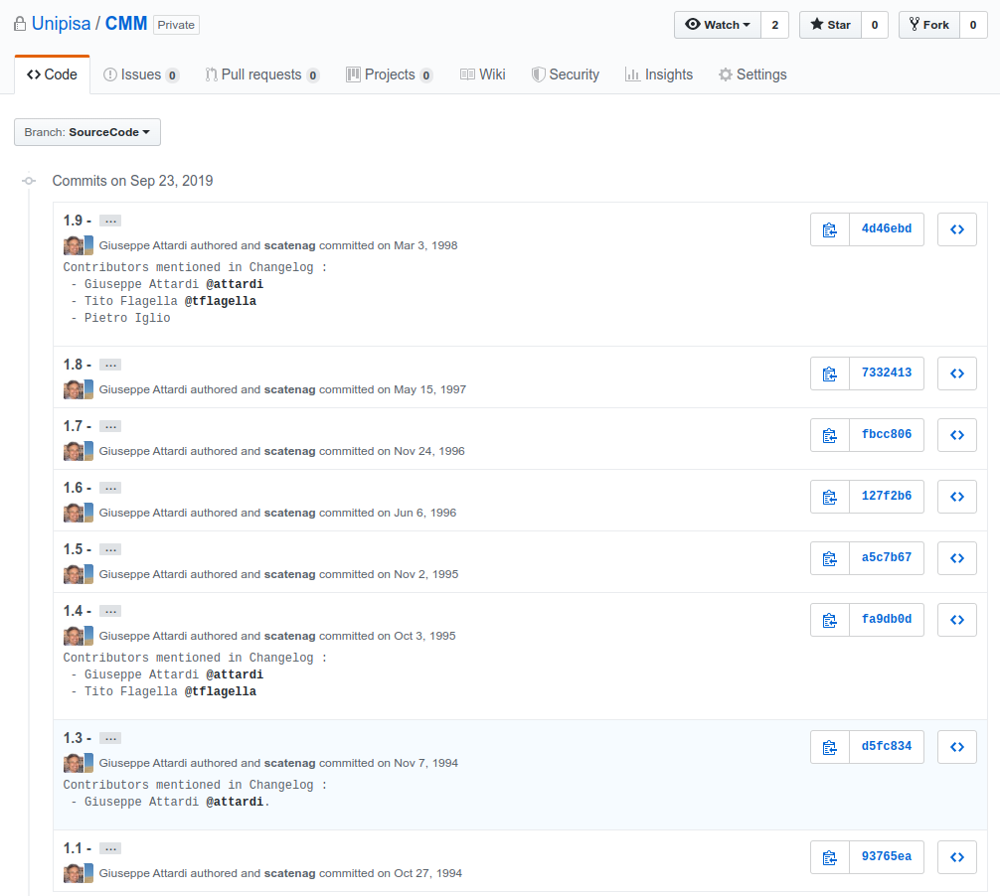{#fig:cmm_sh}

### Create the final repository

We move back to the master branch using the checkout command, then
remove `raw_materials`, `browsable_source` and `source` from it:

	git rm -rf raw_materials browsable_source source

We now create the README.md file, add it and commit changes:

	git add README.md
	git commit -m "Final repository created"

Now we create the final remote repository, that we call "CMM", see
Figure {@fig:create_fin}, and we push the relevant branches (and tags) to it.

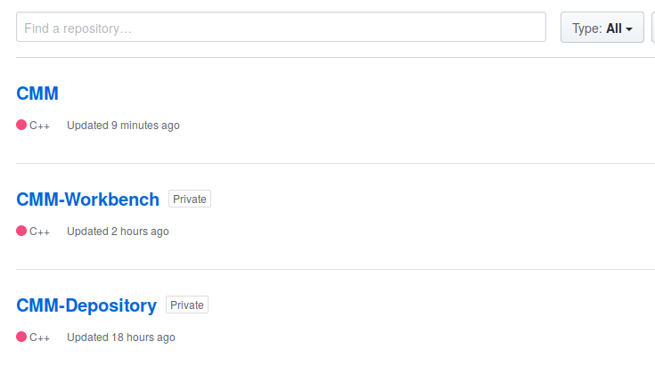{#fig:create_fin}

    git push --tags git@github.com:Unipisa/CMM.git +master:master +SourceCode:SourceCode

To facilitate the search of the created repository, we add the 
"software-heritage", "archive" and "swhappe" tags (in the same way of 
what done for the workbench as shown in Figure
{@fig:workbench_tags}).

Figures {@fig:cmm_final}, {@fig:cmm_depo}, {@fig:cmm_wb} show the final result of CMM, their Depository and
Workbench.

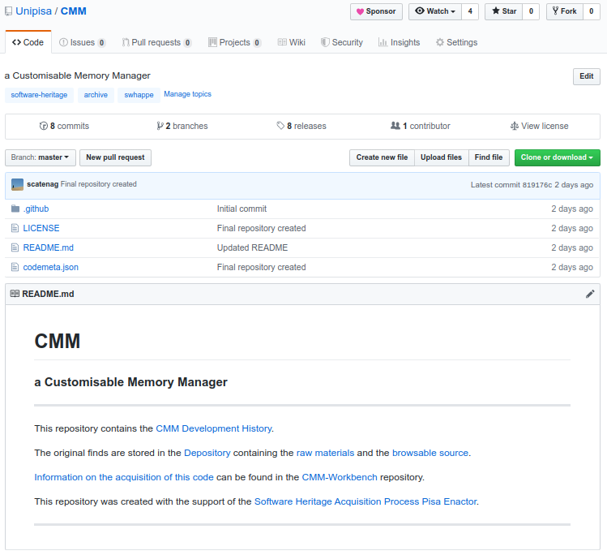{#fig:cmm_final}

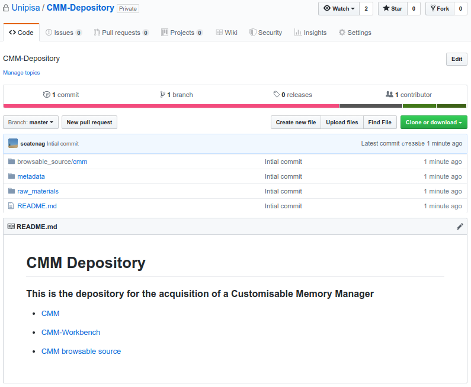{#fig:cmm_depo}

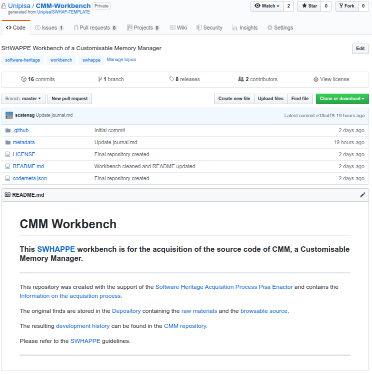{#fig:cmm_wb}

### Publish the repositories and trigger Software Heritage acquisition

In order to publish the Depository and SourceCode repositories we have to set
their visibility to "public", either through GitHub web interface or using the
GitHub API as follows:

    curl -s -H 'Authorization: token '$auth_token'' 
     -H "application/vnd.github.baptiste-preview+json" 
     --data '{"private": false}'
     -X PATCH https://api.github.com/repos/$org/$repository_archive

where **\$repository\_archive** is CMM or CMM-Depository and **\$auth\_token**
is the authorizzarion token. As a result, the code is now publicly visible at

[**[https://github.com/Unipisa/CMM/]{.underline}**](https://github.com/Unipisa/CMM/)

Finally, we trigger the archival of this repository in Software
Heritage, using the "save code now" functionality. This can be done
using the web interface at
**[[https://save.softwareheritage.org]{.underline}](https://save.softwareheritage.org)**,
or by connecting to the API on the command line as follows:

    curl -s -X POST https://archive.softwareheritage.org/api/1/origin/save/git/url/$repo_url

where  **\$repo_url** is `https://github.com/Unipisa/CMM/`.

A short time after (this may go up to a few hours for huge repositories), the archived software will be visible in the Software Heritage archive
at 

[**[https://archive.softwareheritage.org/browse/origin/https://github.com/Unipisa/CMM]{.underline}**](https://archive.softwareheritage.org/browse/origin/https://github.com/Unipisa/CMM)

### Fill the Workbench metadata

In order to preserve information about the curation process we have to fill the template files under the Workbench `metadata`.
Starting from some template files (see Figure {@fig:cmm-metadata}, left), we obtain what shown in Figure {@fig:cmm-metadata}, right.

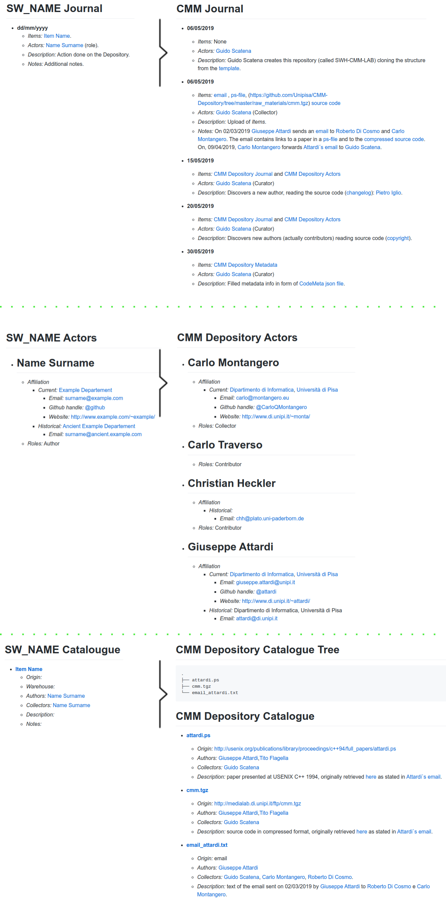{#fig:cmm-metadata}

In particular we should create :

+ a catalogue : `metatdata/catalogue.md`, where each item in the `raw_materials` should have a record describing its origin, the possible warehouse, their authors and collectors along with a description. The result of `tree -a` on `raw_materials` should be included;
+ a journal :`metatdata/journal.md`, where each collect and curate action should be annotated;
+ an actors registry: `metatdata/actors.md`, every person taking part in the process should be registered, with their roles, affiliations and contact information;
+ a notepad : `metatdata/journal.md` where write possible information not covered by previous files.

<a name="appendixa"/>
Appendix A - General Motivation for using Git and GitHub
================================

The choice of Git as the designated tool for traceability and historical
accuracy, and of GitHub as the unifying platform to support the SWHAP
process proceeds from several considerations that we review below.

First of all we discuss the choice of *Git*. One of the key requirements
set forth for SWHAP is the need to ensure *full traceability* of the
operations performed on the recovered digital assets. This means that
each of the virtual places must provide means to record the history of
the modifications made to the digital assets, with information on *who
did what and when*. It is very convenient to use the same tool in all of
the virtual places of the process, as this reduces the learning effort
and streamlines the process. All modern version control systems provide
the needed functionality, and we have chosen *Git* as our standard tool,
as it is open source (another of our requirements) and broadly adopted.
*Git* is a powerful tool, and requires some expertise to make the most
out of it. However, a large part of the process is scriptable, and this
will hide the underlying complexity to the final user, which can then
focus on the main issue: curating and preserving the code and its
history.

Another important motivation for our choice of Git is the ability to
support *historical accuracy*, i.e., providing a faithful view of the
history of both the recovered source code and the acquisition process,
as prescribed by the SWHAP key requirements. This is properly
accommodated by the commit and versioning mechanisms offered by Git,
that allow to separate authors from committers: this way on can record
both the story of the original software and the story of its curation.

Finally, we had to choose one of the many online platforms that allow to
collaborate using *Git*. GitHub, GitLab.com and Bitbucket are the most
known ones and are all regularly archived in Software Heritage, so that
*long term availability* of their contents is preserved, no matter which
one of these platforms is chosen.

Among all these platforms, GitHub is by far the most popular and active,
and is also the platform adopted by the University of Pisa, so it was a
natural choice, and we believe this will make the learning curve gentler
for most SWHAP adopters.

In the following, we provide detailed guidelines to instantiate the
process using Git on GitHub. We think that most of what is described in
the guide can be easily adapted to any of the other *Git*-based
collaborative platforms.

<a name="appendixb"/>
Appendix B - Tools that can help
================================

Here is a list of tools for code acquisition and curation that have been
used during the initial experimentation of SWHAPPE:

-   Used/suggested OCR:

    -   Tesseract
        ([[https://github.com/tesseract-ocr/]{.underline}](https://github.com/tesseract-ocr/)).
        It can be installed and used from command line. An API is also
        provided to use the OCR in a script.

    -   OCR.space
        ([[https://ocr.space/]{.underline}](https://ocr.space/)).
        Online OCR and free API.

-   Dedicated scripts:

    -   DT2SG-Directory Tree 2 Synthetic Git
        ([[https://github.com/Unipisa/SWHAP-DT2SG]{.underline}](https://github.com/Unipisa/SWHAP-DT2SG)).
        Creates the synthetic history of the software.

    -   SWHAP-EXAMPLE([[https://github.com/Unipisa/SWHAP-EXAMPLE]{.underline}](https://github.com/Unipisa/SWHAP-EXAMPLE))

Many other tools exist, and are currently under construction and will be
loaded on the SWHAPPE repository on GitHub.

<a name="appendixc"/>
Appendix C - A few tips on Github
=================================

*Git* is a distributed version-control system for tracking changes in
source code during software development. Here, we provide some
references on *Git* and the GitHub platform.

For a review on GitHub key concepts, you can see the following glossary:

[[https://help.github.com/en/articles/github-glossary]{.underline}](https://help.github.com/en/articles/github-glossary).

In order to fully exploit Github, you should install *Git* on your pc:

[[https://git-scm.com/book/en/v2/Getting-Started-Installing-Git]{.underline}](https://git-scm.com/book/en/v2/Getting-Started-Installing-Git).

This will allow you to use Git from command line. Even if it can be less
intuitive, it's more powerful than working with the web interface: for
instance, you can upload folders and files of any size, without the
limitations of the latter. Furthermore, using Git commands allows for
instantiating the process on any Git supported platform. For a review of
the commands, please check the manual: [[
https://git-scm.com/docs]{.underline}](https://git-scm.com/docs).

As an alternative, if you're using a Mac or Windows, you can download
Github Desktop, which provides a comfortable GUI: [[
https://desktop.github.com/]{.underline}](https://desktop.github.com/).

For more information about the commit mechanism and how to see the log
of changes, please see the following link:
[[https://git-scm.com/book/en/v2/Git-Basics-Viewing-the-Commit-History]{.underline}](https://git-scm.com/book/en/v2/Git-Basics-Viewing-the-Commit-History).
	
To implement the process and separate areas, we chose to create two
different branches (Depository and SourceCode) and get the corresponding
repositories from them. Each branch has an independent commit history,
thus the history of Depository and SourceCode is kept clean and easy to
consult. Here is a discussion on how to see the branch history:
[[https://stackoverflow.com/questions/16974204/how-to-get-commit-history-for-just-one-branch]{.underline}](https://stackoverflow.com/questions/16974204/how-to-get-commit-history-for-just-one-branch).

<a name="bibliography"/>
Bibliography
============

[^1]: This is a complex issue, that may need to be handled according to
    country-specific regulations and is out of the scope of the present
    document. In the United States, one may leverage the "fair use"
    doctrine, see for example the detailed analysis presented in
    [[https://www.softwarepreservationnetwork.org/bp-fair-use/]{.underline}](https://www.softwarepreservationnetwork.org/bp-fair-use/)

[^2]: See for example
    [[https://collectionstrust.org.uk/spectrum/]{.underline}](https://collectionstrust.org.uk/spectrum/).

[^3]: See for example in
    [[https://collectionstrust.org.uk/spectrum/]{.underline}](https://collectionstrust.org.uk/spectrum/).

[^4]: More information on Git *branches* can be found in [[Appendix
    B]{.underline}](#p6ks12u37m17).

[^5]: See the documentation on
    [[https://help.github.com/en/articles/creating-a-repository-from-a-template]{.underline}](https://help.github.com/en/articles/creating-a-repository-from-a-template)

[^6]: See the documentation on
    [[https://help.github.com/en/articles/cloning-a-repository]{.underline}](https://help.github.com/en/articles/cloning-a-repository)

[^7]: See the documentation on
    [[https://help.GitHub.com/en/articles/adding-a-file-to-a-repository-using-the-command-line]{.underline}](https://help.github.com/en/articles/adding-a-file-to-a-repository-using-the-command-line).

[^8]: [[https://github.com/Unipisa/SWHAP-TEMPLATE]{.underline}](https://github.com/Unipisa/SWHAP-TEMPLATE)

[^9]: The repository can be either public or private according to the
    policy of the acquisition team.

[^10]: See [[Appendix B]{.underline}](#p6ks12u37m17) for a brief
    discussion on the convenience of working locally, rather than
    remotely via the web interface.

[^11]: Here shown with unix command line.

