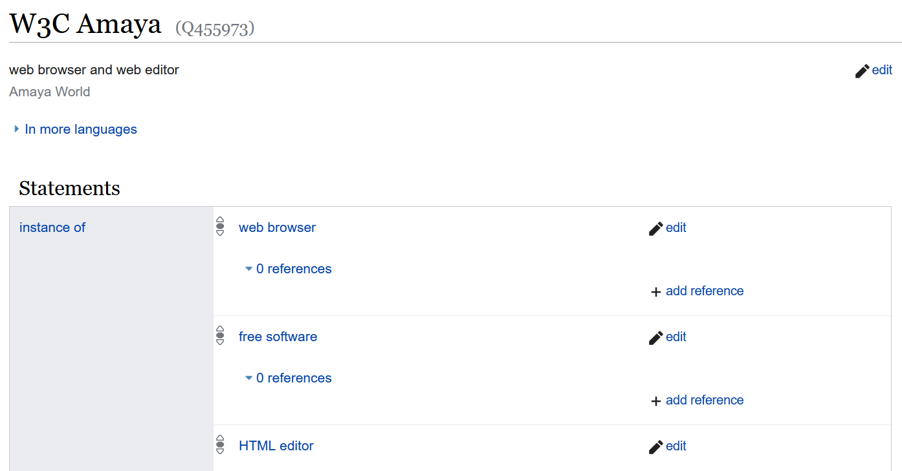
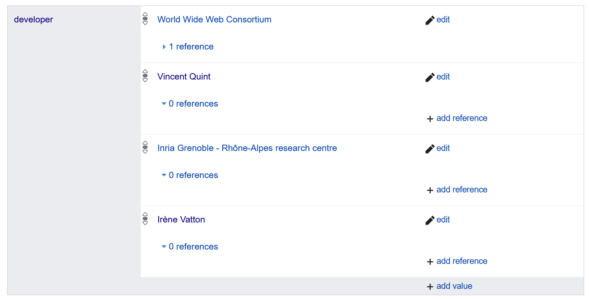
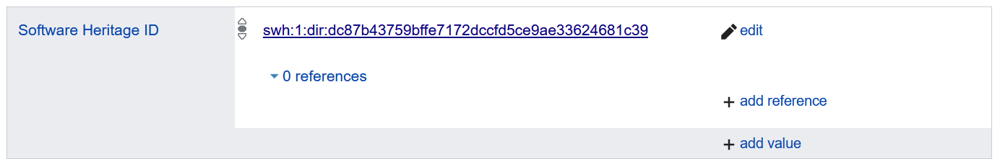
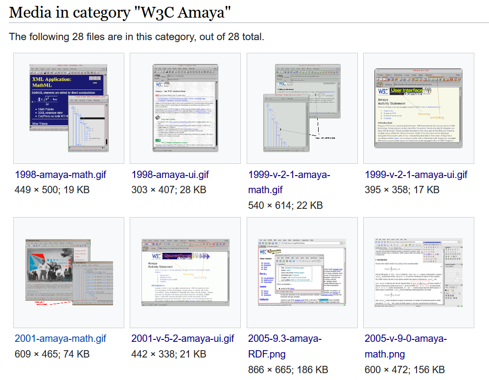

Archiving other historical artefacts linked to the history of the software
=========================================================================

Alongside preserving the source code of your software, we encourage you to also look into any historical materials or information that might be associated with it and be worth preserving. To do so you might reach out to the historical developpers of the software or check if the historical project website has been archived by the [Internet Archive](https://archive.org/) to recover some screenshots or team pictures.  

Such materials and information are worth preserving, and we will give some indication regarding how this can be achieved leveraging open-source solutions as much as possible.
The following instructions are based on the real-life example of Amaya, a web browser and editor developped by Inria and W3C in the 1990's. The preservation work done on Amaya involved three historical developpers of the software. Together they could provide information about the project and recovered some pictures, screenshots and documents. 

### Wikipedia and Wikimedia

Wikimedia and Wikidata are well suited to archive general software information as well as pictures and photos. 

Well established guidelines are available for contributing materials to
Wikimedia (see
[[https://commons.wikimedia.org/wiki/Commons:First\_steps/Contributing]{.underline}](https://commons.wikimedia.org/wiki/Commons:First_steps/Contributing))
and Wikidata (see
[[https://www.wikidata.org/wiki/Wikidata:Data\_donation]{.underline}](https://www.wikidata.org/wiki/Wikidata:Data_donation)
), but we will try to provide some SWHAP specific guidance thereafter. 

Beware, only items with [free license](https://commons.wikimedia.org/wiki/Commons:Licensing#Acceptable_licenses) are allowed to be archived on Wikimedia. Typically, if the software you are working on is distributed under a free-license (typically an open-source software), the logos or screenshots taken will also be considered as being under free license. 

To start, search Wikidata to see if an item for the software title exists. If no item is found, [create a new item](https://www.wikidata.org/wiki/Special:NewItem). A new item should be created as an _instance_ of one or several larger category. You can typically use a generic _software_ category here, or be more specific: _free software_, _programming languge_, _web browser_ etc. Each Wikidata item is identified by a _Q number_ that you can see at the top of the item page.  

{#fig:amaya_wiki_inst}

An item is made up of different _statements_, which are different block of information linked to that article. Each statement describes a different _property_ of the item. A proprerty is identified with a code starting with letter `P`, which we will refer to later on to let you easily search for a given property. 

Add statements to the Wikidata item based on the `version_history.csv` and `actors.md`files as well as any other available information using properties related to software. You can use the Wikidata item about [Scilab](https://www.wikidata.org/wiki/Q828742) as an example.

Typically you will want to register:
- The different versions of the software and their publication date using the _software version identifier_ property (P348)
- The programming languages using the _programmed in_ property (P277)
- The source code repository URL using (P1324)
- The people or entities who contributed to develop the software using the _developer_ property (P178)

{#fig:amaya_wiki_dev}

In order to be able to fill in the _developer_ section, you will first need to make sure that the people or entities who developped the software are also referenced in Wikidata. If they're not, you will need to create new Wikidata items first for these people or entity. If you collected pictures of the people who developped the software, add them to their Wikidata page using the _image_ statement (P18). Once this is done you can come back to the software items and fill in the _developer_ statement.   

Using the _Source code repository URL_ statement (P1324), add the link towards the Software Heritage archived source code. 
Using the _Software Heritage ID_ statement (P6138), add the Software Heritage identifier (that can be found in the _Permalinks_ of the archived source code.)

{#fig:wiki_swh}

**Pictures, photos and videos**

Regarding archiving images and pictures: if there is only one image to archive, you can directly link it to the Wikidata item using a new statement with _image_ property (P18). 
If there are multiple images, you will need to upload them in [Wikimedia Commons](https://commons.wikimedia.org/wiki/Main_Page), the media database of Wikipedia. In Wikimedia, media are grouped in _Categories_. One media can belong to several categories. 

Start by checking if there already is a Wikimedia category name after your software using the search bar. 
If no result if found, you will be offered to create a new category. Do so and name it after your software (the name can typically be the same as the Wikidata item).  
Then use the [_Wikimedia upload wizard_](https://commons.wikimedia.org/wiki/Special:UploadWizard) to upload your different documents, and link them each time to the right category.

{#fig:amaya_wiki_media}

Once this is done, return to the Wikidata software item and use the _Commons category_ statement (P373) to connect the Wikimedia category.

**PDFs**

If you collected any document in PDF format (flyers, diagrams, notes, internal communications, correspondences), you can upload them to Wikimedia in the exact same way as pictures or videos. 
Once this is done, go back the Wikidata item and use the _document file on Wikimedia Commons (P996)_ statement to link these documents to the Wikidata item. 

<!--
**Publications**
MF: where shall we archive publications? HAL? Wikimedia
-->

### Institutionnal archives

There are different reasons why you may not be able to archive the material you collected on Wikimedia.

**Size issue**

Wikimedia has a maximum upload size of 100 megabytes which can be too restrictive to upload larger files like videos. 

**Copyright issues**

It might be the case that some items you collected are under restricted license. For example, the copyright owner of a picture might agree to the picture beeing used for educational purpose, but not for commercial purpose. In that case you are not allowed to publish it on Wikimedia/Wikidata. 

**Inria Photothèque** 

In the context of the Inria Software Preservation effort, we recommand to submit any photo or video you may not be able or willing to store on Wikimedia to the Inria Médiathèque.

TODO: add process

### Physical archives

In the context of the Inria Software Preservation effort, we recommand to submit any physical artefact you may want to safeguard to l'Expo Inria, the Inria museum initiative.

TODO: add process
