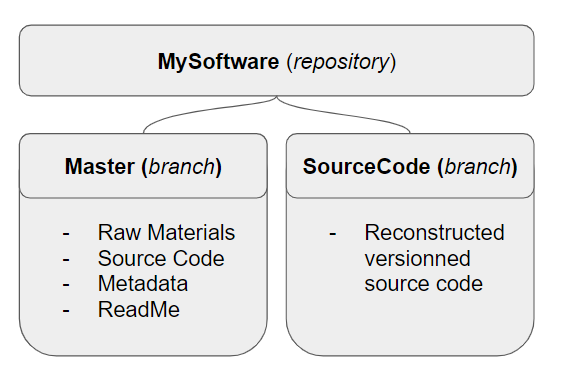
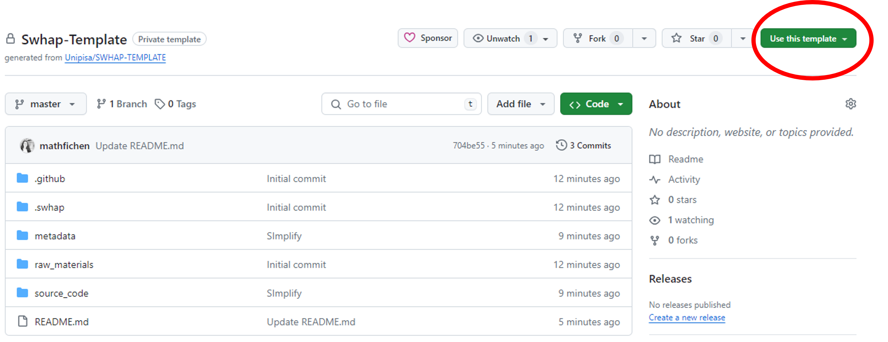
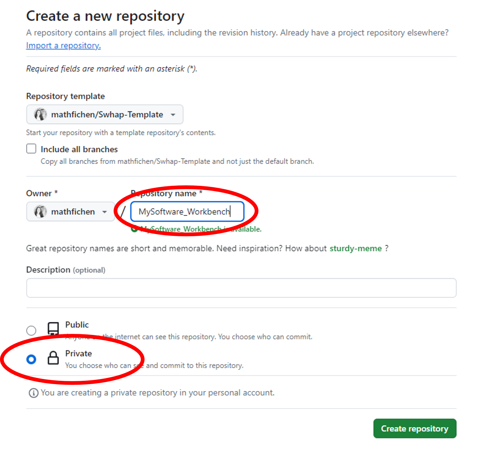
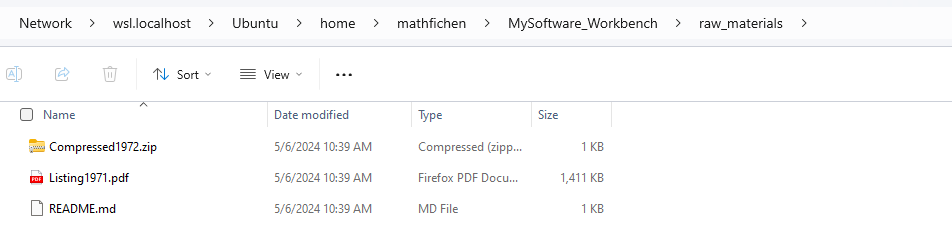
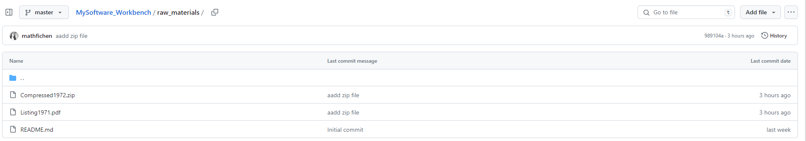
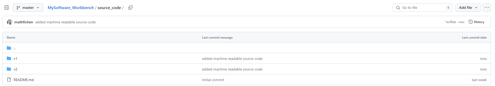
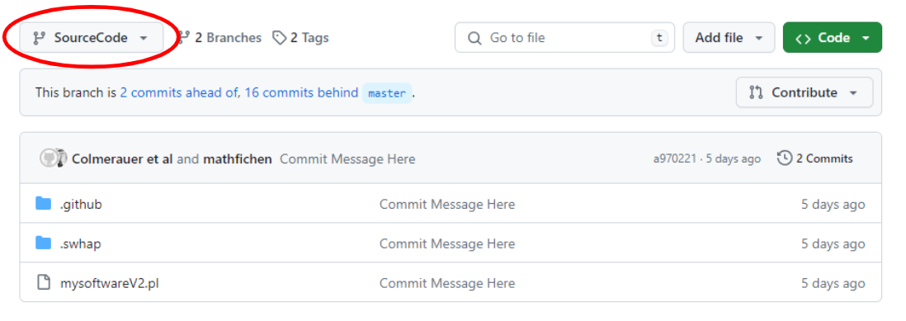
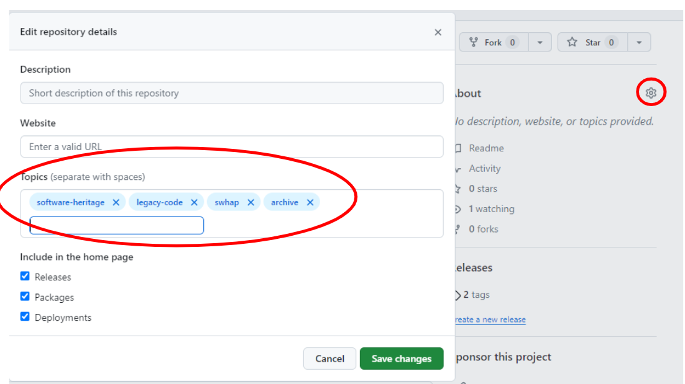
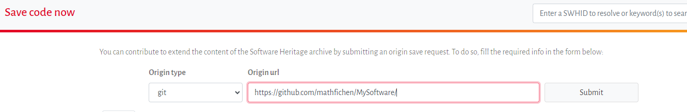

<a name="intro"/>

Introduction
============

The primary goal of this guide is to help anyone archive **legacy source code** into the **Sofware Heritage universal archive**. 
By legacy, we mean any source code which has not been developped on a modern software forge (such as Github or Gitlab). 
Typically the source code can be stored on a private hard drive, a USB stick or even on paper listings and you might be worried it will get lost if not archived properly. 
The guide focuses on preserving the software **source code**, which we believe is worth preserving for itself. The process does not tackle the execution of this code, or how to deal with emulation systems. 

<--!
Appart from archiving the source code itself, the guide will also propose solutions to help archive historical artefacts linked to the story of the source code (such as pictures, screenshots, reports etc.) and help you build an online presentation of the software. 
The guide is devided into three sections, each of them can be read and executed independently of the others.

1. How to archive legacy source code into Software Heritage Archive
2. How to archive other historical artefacts linked to the history of the software
3. How to build an online presentation of the software
-->

Note that the process aims at preserving and presenting legacy source code and related materials in a **digital** format, to ensure long term availability of the curated materials and the possibility to share and present it to a broad audience. 
Archiving physical artefacts is not the primary goal of this guide but we will provide some contact points if you would intend to do so. 

This document builds up on the SWHAP, the [***SoftWare Heritage Acquisition Process***](https://www.softwareheritage.org/swhap/) to rescue, curate and illustrate landmark legacy software source code. The initial version of this guide was published in 2019 as a joint initiative of Software Heritage and the University of Pisa, in collaboration with UNESCO. This guide also aims at simplifying the practical implementation of the SWHAP as proposed by Pisa Univeristy in the [SWHAPPE (SWHAP Pisa Enactor)](https://github.com/SoftwareHeritage/swhapguide/blob/master/SWHAP%40Pisa.pdf).

Why preserve legacy source code?
================================

Software is everywhere, binding our personal and social lives, embodying
a vast part of the technological knowledge that powers our industry,
supports modern research, mediates access to digital content and fuels
innovation. In a word, a rapidly increasing part of our collective
knowledge is embodied in, or depends on software artifacts.

Software does not come out of the blue: it is written by humans, in the
form of software Source Code, a precious, unique form of knowledge that,
besides being readily translated into machine-executable form, should
also "be written for humans to read" (@Abelson:SIC85), and "provides a
view into the mind of the designer" (@Shustek06).

As stated in the Paris Call on Software Source code as Heritage for
sustainable development (@ParisCall2019), from the
UNESCO-Inria expert group meeting, it is essential to preserve this
precious technical, scientific and cultural heritage over the long term.

Software Heritage is a non-profit, multi-stakeholder initiative,
launched by Inria in partnership with UNESCO, that has taken over this
challenge. Its stated mission is to collect, preserve, and make readily
accessible all the software source code ever written, in the Software
Heritage Archive. To this end, Software Heritage designed specific
strategies to collect software according to its nature (@swhcacm2018).

For software that is easily accessible online, and that can be copied
without specific legal authorizations, the approach is based on
automation. This way, as of September 2024, Software Heritage has
already archived more than 18 billion unique source code files from over
300 million different origins, focusing in priority on popular software
development platforms like GitHub and GitLab and rescuing software
source code from legacy platforms, such as Google Code and Gitorious
that once hosted more than 1.5 million projects.

For source code that is not easily accessible online, a different
approach is needed. It is necessary to cope with the variety of physical
media where the source code may be stored, the multiple copies and
versions that may be available, the potential input of the authors that
are still alive, and the existence of ancillary materials like
documentation, articles, books, technical reports, email exchanges. Such
an approach shall be based on a focused search, involving a significant
amount of human intervention, as demonstrated by the pioneering works
reconstructing the history of Unix (@SpinellisUnix2017) and the source code
of the Apollo Guidance Computer (@VirtualAGC).

What if I am stuck or have a question ?
======================================

Because we are still developping and improving the SWHAP process you may stumble upon some difficulties, have some doubts on the best practices to adopt or you may just want to suggest an improvment. 
To do so, you can join our SWHAP [mailing list](https://sympa.inria.fr/sympa/subscribe/swhap?previous_action=info) and share your questions and your comments with the community. 

Archiving legacy source code into Software Heritage Archive
================================================================
Requirements and setup
----------------------

To start archiving legacy source code in the Sofwtare Heritage Archive, the following elements are required:
- A source code in machine readable format
- A Github account
- A Linux Console
- Git
- Connect to Github with SSH

### A source code in machine readable format

If your source code is already stored in a digital machine-readable format, you can skip this step. 
However, if your source code is not machine-readable (typically your code is a paper listing), a little prework is required so that your code can be ingested in the Software Heritage Archive. 

1) Use a scanner to digitalize your code. If your code is too long to be scanned in its entirety, select a section that you find most relevant for archiving.
2) Convert your code to a machine-readable format, for example by using an OCR tool such as [OCR.space](https://ocr.space/) and paste your code into a text editor.
3) Check for any error, correct if needed, and save your code using the file extension linked to the programming language asociated with your code. 

### A Github account

Source code ingestion into the Software Heritage archives will require your source code to be uploaded into a public forge first, such as Github or Gitlab. 
In this guide we will show you how to do it using Github, and you will therefore need a Github account. If you do not already own one, you can easily create it [here](https://github.com/signup).

### A Unix Console

To properly deposit your source code into the archive, you will need to use the Git versionning management system. You do not need an extensive understanding of Git mechanisms to do so and we will guide you step by step.
However, the command lines we will use are written for a Unix exploitation system. If your computer is running on a Unix-like exploitation system (Unix, Linux, MacOS), you can skip this step. If you are using Windows, you can download a Linux subsystem for Windows.

To do so, you can find detailed instructions [here](https://learn.microsoft.com/en-us/windows/wsl/install).
In practice do the following:
- Open Windows PowerShell
- Enter the following command line: `wsl --install`
- Wait for the installation to complete
- Restart your computer
- Re-open Windows PowerShell and open a new Ubuntu tab (clicking on the small + sign on top)
- You will be asked to enter a new user name and password. And that's it, you can start typing linux command lines in your console.

### Git

Git is the versionning system we will use to curate your source code. If you do not have Git installed yet, you will need to install it. From your Linux console enter the following instruction: 
	
 	sudo apt install git-all
 
If it does not work the first time, you may need to first update the local packages index using the following command line: 
	
 	sudo apt-get update 

### Connect to GitHub with SSH

The archiving process will require you to interact with Github from your Linux console. To do so, you need to establish a secure SSH connexion between Github and your personal computer. You can find detailed instructions [here](https://docs.github.com/en/authentication/connecting-to-github-with-ssh). If you do not already have a SSH key, here is what you need to do:
- Create a new SSH using this command line `ssh-keygen -t ed25519 -C "john.smith@gmail.com" ` using your own email address. Press enter to accept the default repository or adjust as you wish. Enter a passphrase if you wish of leave empty and press enter.
- Then add your newly created SSH key into your ssh-agent. Check that your ssh-agent is running by entering: `eval "$(ssh-agent -s)" `. Then add your key by entering: `ssh-add ~/.ssh/id_ed25519`
- Navigate to the folder where your SSH key is stored. If you use a Windows Linux Subsystem, it should be in `Linux>Ubuntu>home>myname>.ssh`. Open the public key file `id_ed25519.pub` and copy the key
- Now go to your Github account, click on your logo on the top right corner, go the `Settings` and `SSH and GPG keys`. Click on `New SSH key`, enter a name to your key and paste the public key. Click on `Add SHS key`

You are done with the settings and you are now ready to archive your code into the Software Heritage Universal Archive!
    
Archiving your legacy code
----------------------
In order to archive your legacy code on the Software Heritage Universal Archive, you first need to deposit your code on a public forge such as Github or Gitlab, and most of the work we will do in the following steps aims at doing so in a clean way. In this guide we will leverage the most widely used forge, Github. Note that the process could be easily done on any other forge of your choice. 

We will provide a step by step guidance, using a dummy software name _MySoftware_ as an example. 

**Wait, why don't I just manually upload my code on Github then?**
If you just uploaded your source code files on Github the metadata associated with your code would be wrong. For example, if I, Math, uploaded a code initially written in 1987 by Tim Berners Lee on Github, the commit data will tell that I am the author and that the code was written in 2024. That would be obviously wrong. Using Git command lines to upload our source code on Github will allow us to properly set the metadata. 

If your source code has several versions we will also reconstruct the version history, using Git to _stack_ each version upon the other and make them easier to navigate and compare one to another for future viewers. 

### Final result

The structure we want to achieve on Github before launching the archival on the Software Heritage archive is the following:
- A public repository, named after the software you want to archive (here called _MySoftware_)
- The repository has two branches:
	- The _Main_ branch contains all your initial materials (_Raw Materials_), your source code in machine readable format (_Source Code_), the relevant Metadata as well as a ReadMe file helping a future visitor to navigate the repository.
 	- The _SourceCode_ branch contains the reconstructed development history of your source code, i.e. each version of your code stacked one upon the other.
 
Those two branches allow a future viewer to navigate in your legacy code according to two different angles: either browsing through the historical material and its retranscription (_Main_ branch), or viewing the code as if it had been developped with a modern versionning system (_Source Code_ branch).  

{#fig:repoStructure}

**Some vocabulary**
If you are not familiar with Git:
- A _repository_ is similar to a folder, a place where you can store your code, your files, and each file's revision history
- A _branch_ is a parallel version of your code that is contained within the repository, but does not affect the primary or main branch.

### Prepare your code for archival

As mentionne earlier, to start the process your code needs to be in a machine-readable format.
If the code is only available in non digital form (e.g. printed listings), you can either transcribe it manually, or use a scanner and an OCR (optical character recognition) tool to parse it. In the example below we scanned a paper listing. The scanner had integrated OCR function, so we could copy-past the result in a text editor and correct the errors manually. When saving our edited file, we made sure to correct the file extension to reflect the programming language (in our case .pl). 

{#fig:OCR}

If the raw source code is an archived and/or compressed file (.tar or .zip), you should unpack it locally on your computer. 

For historical accuracy purpose we will upload both your source code in its initial format, and in its machine-readable format. 

### Set up your working environment

To archive your legacy source code we will be using Github, and we prepared a Github template that you can clone (if you are not familiar with Github lingo _to clone_ means _to make a copy_) to create your own working space. 
Visit [the template page](https://github.com/mathfichen/Swhap-Template), on the upper right hand corner click on `Use this template` > `Create a new repository` 

{#fig:template}

The repository you will create is a temporary working environment, and we recommand naming it `MySoftware-Workbench` (replace "MySoftware" by the actual name of your software and make it private.

{#fig:createWorkbench}

Via the Github interface you can edit the `Read.me` file, using the actual name of your software. To edit a file in Github click on the pencil symbol. When you are done editing, click on `Commit` to save your changes. 

To start working, we create a local copy on our computer, cloning this
repository[^10]. By clicking on the green button `Code`
(Figure {@fig:cmm_wb_inst}), we get a link that we can use for this purpose in the
following command from the command line:

`git clone git@github.com:mathfichen/MySoftware_Workbench.git`

This command will create local version of the Workbench on your computer, that you can manipulate (add files, edit files, create folders etc) the same way you would usually do it.

In our case (using Linux Subsystem for Windows), the local copy of `MySoftware_Workbench` has been created at this location:
`Linux` > `Ubuntu` > `home` > `mathfichen` > `MySoftware_Workbench`.

Open a Linux command line interpreter an navigate to `MySoftware_Workbench`.
In our case the interpreter current directory is `/home/mathfichen`, so we juste type: `cd MySoftware_Workbench`

### Upload collected files

You are now ready to upload your materials to the `Workbench`. 
In your local Workbench, navigate to the `raw_materials` folder. This folder is meant to store all your initial materials, to help any future viewer understand the origin of the code. This covers the source code in its initial format (scanned listing, compressed file etc.) as well as any contextual element. For example, if the source code was sent over to you by the historical author via email, you can also store this email. You can also store any item you may deem relevant to understand the historical context in which the software was produced, such as technical documentation. 

In our case we uploaded two documents: a scanned listing from 1971 and a later digital version from 1972 in a compressed file. 

{#fig:RawMaterials_local}

To synchronize our local Workbench with the remote repository, we run the following command lines:

	git add raw_source_code
	git commit -m "Added raw material"
	git push

The resulting state of `raw_materials` is shown in Figure {@fig:RawMaterials}.

{#fig:RawMaterials_local}

### Fill in the metadata

Then navigate to the `metadata` folder and open the `catalogue.md` file using any text editor. This file will help any future viewer to better understand the different items you uploaded. Edit the file, filing in the metadata linked to each item your uploaded.  

Go back to the `metadata` folder and go to the `license.md` file and fill in any license information you have about the usage of the software you are archiving. 

Finally, go back once again to the `metadata` folder and update the `version-history.csv` folder. The content of this file should correspond to the data you will want to use later on in the process when reconstructing the code synthetic history (see section called _(Re-)Create the development History_)

The `codemeta.json` file will be updated at the end of the process. 

Synchronize with the remote repository using the follwing command lines:

	git add metadata
	git commit -m "Updated metadata"
	git push

You can see an example of the different metadata files loooking at [_MySoftware_ final repository](https://github.com/mathfichen/MySoftware/tree/master/metadata)

### Upload machine readable source code
We are now going to upload the machine readable versions of your source code into the `source_code` folder. Each version of the source code should be in a machine readable format, and stored in a dedicated sub-folder. 

In our case we create two folders, `v1` and `v2`. `v1` contains the transcribed version of our scanned paper listing from 1971, and `v2` contains the unzipped source code from 1972. 

When you are done, synchronize with the remote repository:
	
	git add source_code
	git commit -m "Added machine readable source code"
	git push

You can chcek the result in the distant repository.

{#fig:RawMaterials_local}

### (Re-)Create the development History

The development history can now be (re-)created either by issuing manually (i.e. for each version directory) the appropriate git commands, or by using a specialised tool. This recreated development history will be stored in a dedicated branch, that we will call `SourceCode`. This branch will be created as an empty orphan branch, meaning that it will be cleaned of any previous content or commits information, as if it were a standalone branch. 

##### Manually

We first create the SourceCode orphan branch

	git checkout --orphan SourceCode

 An remove all files and folders:
 	git rm -rf *

Then, for every directory of `source_code` containing a version of the source code, in
chronological order, we copy its contents from the `master` branch to the
`SourceCode` branch, and commit it with the appropriate metadata, as recorded in `version_history.csv`.

In our case here is how
we copy the source contents into our branch:

	git checkout master -- source_code/v1
	mv source_code/v1/* .

Then we use the following template to create manually an individual commit/release:

	export GIT_COMMITTER_DATE="YYYY-MM-DD HH:MM:SS"
	export GIT_COMMITTER_NAME="Commiter Name"
	export GIT_COMMITTER_EMAIL="email@address"
	export GIT_AUTHOR_DATE="YYYY-MM-DD HH:MM:SS"
	export GIT_AUTHOR_NAME="Author Name"
	export GIT_AUTHOR_EMAIL=<email@address>"
	git add -A
	git commit -m "Commit Message Here"

 In our case

 	export GIT_COMMITTER_DATE="2024-05-01 00:00:00"
	export GIT_COMMITTER_NAME="Math Fichen"
	export GIT_COMMITTER_EMAIL="mathfichen@monadresse.com"
	export GIT_AUTHOR_DATE="1972-05-01 00:00:00"
	export GIT_AUTHOR_NAME="Colmerauer et al."
	export GIT_AUTHOR_EMAIL="<>"
	git add -A
	git commit -m "V1 of MySoftware"
	
We also need to add an annotated tag to this version. For version 1 of MySoftware, here is
the command we used, you can adapt it to your needs:

	git tag -a 1 -m "Version 1"

Finally, we clean up the directory before importing a new version

    	git rm -rf *

Redo the previous command lines for each version, starting at `git checkout master -- source_code/v2`. For the last version do not clean up the directory. 

Finally, synchronize with your remote repository, creating a new remote `SourceCode` branch.

  	git push --tags origin +SourceCode:SourceCode

In your distant repository you will now see a new `SourceCode` branch, that will only display the latest version of your code. The development history of your code can be seen in the _commits_ history. 
{#fig:VersionHistory}   

    

##### With DT2SG

If you have numerous source code versions and do not want to reconstruct the development history by hand, the University of Pisa developped a script to do it for you, called [DT2SG](https://github.com/Unipisa/DT2SG). This script will automatically used the information stored into version_history.csv to perform the successive commits.

Here are the associated Git instructions to run it:

	dotnet ./DT2SG/DT2SG_app.dll -r mathfichen/MySoftware_Workbench/source_code/ -m mathfichen/MySoftware_Workbench/metadata/version_history.csv

### Create the final repository

You are now ready to create the final public repository of your Software, that will be ingested into the Software Heritage archive. Go to the Github interface. From the `home` page, click on the `New` green button and create a new public repository, named after your software. 

{#fig:FinalRepo}

We populate this final `MySoftware` repository from our workbench.

    git push --tags git@github.com:mathfichen/MySoftware.git +master:master +SourceCode:SourceCode

To facilitate the search of the created repository, add the "software-heritage", "legacy code", "archive" and "swhap" topic tags to your repository. To do so, click on the `setting` icon of your repository and add the relevant topics. 

{#fig:Topics}   

### Trigger the Software Heritage Acquisition

Even though Software Heritage automatically archives any repository publicly available on Github we suggest yout to specifically schedule it to make sure everything runs smoothly. To do so, visit the Software Heritage ["Save code now" page](https://archive.softwareheritage.org/save/), and submit the URL of your `SWName_Curated` final repository. 

{#fig:saveCodeNowURL}

You can then follow the archival status of your code in the [_Browse Save Request_ tab below](https://archive.softwareheritage.org/save/list/).

Your legacy code is now forever safely archived on the Software Heritage universal archive. You can search for its archive location using its URL in [Software Heritage](https://archive.softwareheritage.org/browse/search/). Your code now has a unique identifier called [_SWHID_](https://docs.softwareheritage.org/devel/swh-model/persistent-identifiers.html) (Software Heritage IDentifier), that can be used for example to cite your code in an academic paper. This _SWHID_ can be found clicking on the `Permalink` tab on the right side of your archived code page.

Also on the `Permalink` tab, you can click on the two `archived` badges and retrieve a markdown code snippet. Use these code snippets in the README of your final software repository. This will display the badges on the first page of your repository, allowing anyone visiting it to click on them and get access to its archive on Software Heritage.

{#fig:badge}

### Create your CodeMeta Json file

The [CodeMeta project](https://codemeta.github.io/) defines a standard JSON structure for software metadata. this JSON will allow your code to be more easily discovered by search engines (including the Software Heritage search engine). You can generate such a JSON file using the [CodeMeta generator](https://codemeta.github.io/codemeta-generator/). Use the _SWHID_ in the `Unique Identifier` section. Add this JSON file to `MySoftware_Workbench`>`Metadata` folder and synchronize with the distant repository. 

	git add metadata
	git commit -m "Updated Codemeta JSON"
	git push

### Congrats

Congrats, you are done archiving your code! Please do not hesistate to share your thoughts and send us feedback using the [mailing list](https://sympa.inria.fr/sympa/subscribe/swhap?previous_action=info). 

